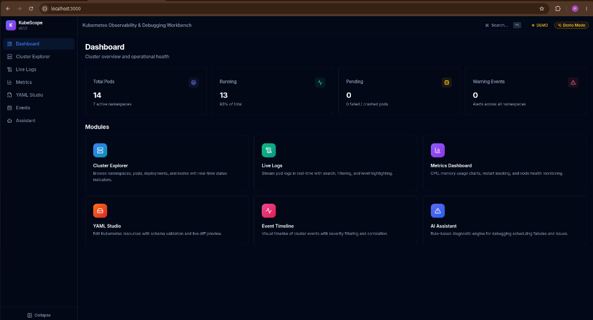
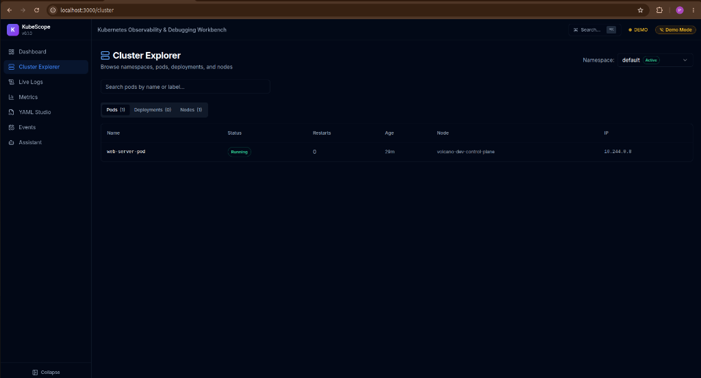
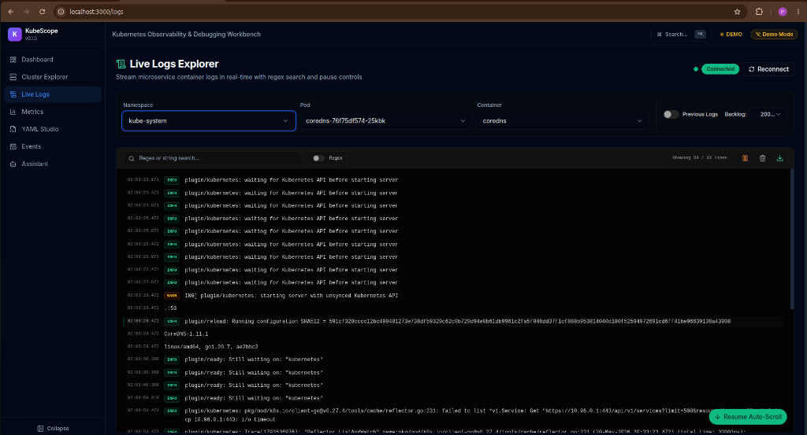
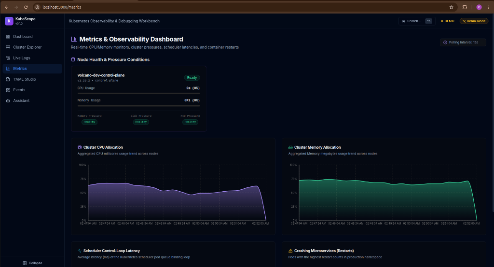
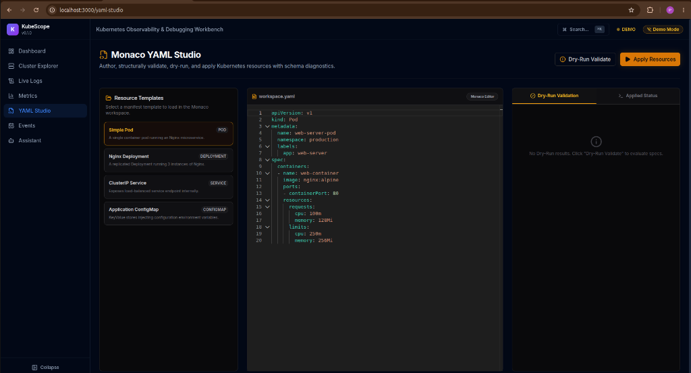
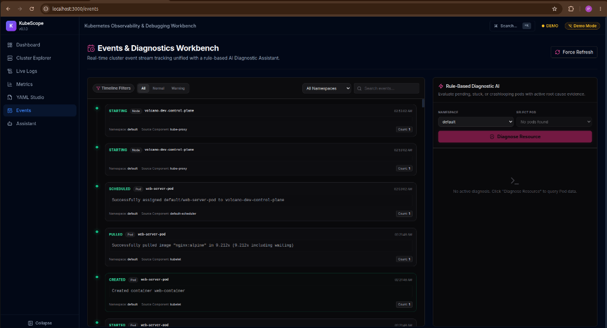
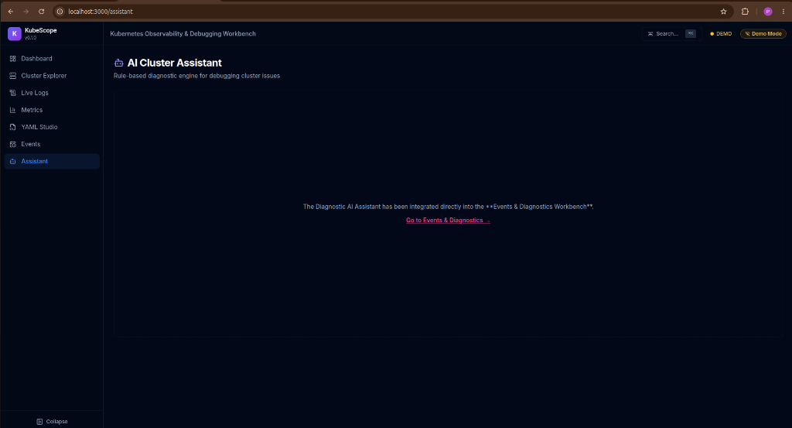

# KubeScope

**Kubernetes Observability & Debugging Workbench**

A full-stack Kubernetes operations platform for cluster debugging, observability, configuration management, and workload diagnostics — built for SREs and platform engineers.


## Preview

### 1. Dashboard Overview


### 2. Cluster Explorer


### 3. Live Logs Explorer


### 4. Metrics Dashboard


### 5. Monaco YAML Studio


### 6. Events & Diagnostics Workbench


### 7. AI Cluster Assistant


## Features

- 🔍 **Cluster Explorer** — Browse namespaces, pods, deployments, and nodes with real-time status
- 📜 **Live Logs** — SSE-powered real-time log streaming with search, filtering, and level highlighting
- 📊 **Metrics Dashboard** — CPU, memory, restart tracking, and node health visualization
- ✏️ **YAML Studio** — Monaco editor with Kubernetes schema validation and diff viewer
- 📅 **Event Timeline** — Visual timeline of cluster events with severity filtering
- 🤖 **AI Assistant** — Rule-based diagnostic engine for debugging scheduling failures

## Tech Stack

| Layer | Technology |
|---|---|
| Frontend | Next.js 14, React, TypeScript, TailwindCSS, shadcn/ui |
| Backend | tRPC, Node.js, @kubernetes/client-node |
| Streaming | Server-Sent Events (SSE) |
| Charts | Recharts |
| Editor | Monaco Editor + monaco-yaml |
| Validation | Zod, js-yaml |

## Quick Start

```bash
# Clone
git clone https://github.com/Priyasharma620064/kubescope.git
cd kubescope

# Install dependencies
npm install

# Run in demo mode (no cluster required)
NEXT_PUBLIC_DEMO_MODE=true npm run dev

# Run with live cluster (requires ~/.kube/config)
npm run dev
```

Open [http://localhost:3000](http://localhost:3000) in your browser.

## Demo Mode

KubeScope includes a full demo mode with synthetic data — no Kubernetes cluster required. Toggle between **LIVE** and **DEMO** mode from the header bar.

## Project Structure

```
src/
├── app/              # Next.js App Router pages
├── components/
│   ├── layout/       # Sidebar, Header, Shell, CommandPalette
│   ├── cluster/      # Cluster Explorer components
│   ├── logs/         # Log viewer components
│   ├── metrics/      # Chart and status card components
│   ├── yaml-studio/  # Editor components
│   ├── events/       # Timeline components
│   ├── assistant/    # Diagnostic chat components
│   └── ui/           # shadcn/ui primitives
├── server/
│   ├── routers/      # tRPC routers
│   └── k8s/          # Kubernetes service layer
├── hooks/            # Custom React hooks
├── lib/              # Utilities and constants
└── types/            # Shared TypeScript definitions
```

## Docker

You can run KubeScope in a Docker container.

```bash
# Build and run with Docker Compose
docker-compose up --build
```

The app will be available at [http://localhost:3000](http://localhost:3000).

## Testing

KubeScope uses Vitest for unit testing.

```bash
# Run tests
npm test
```

## CI/CD

A GitHub Actions workflow is configured in `.github/workflows/ci.yml` to automatically lint, test, and build the application on every push to `main`.

## License

MIT
